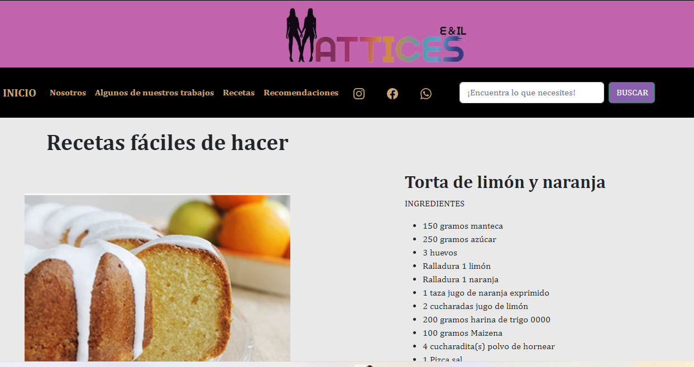
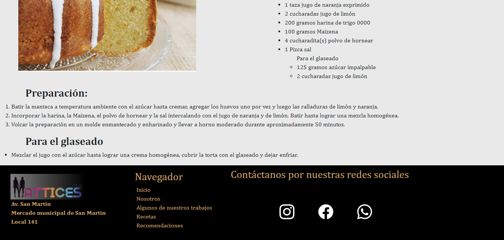
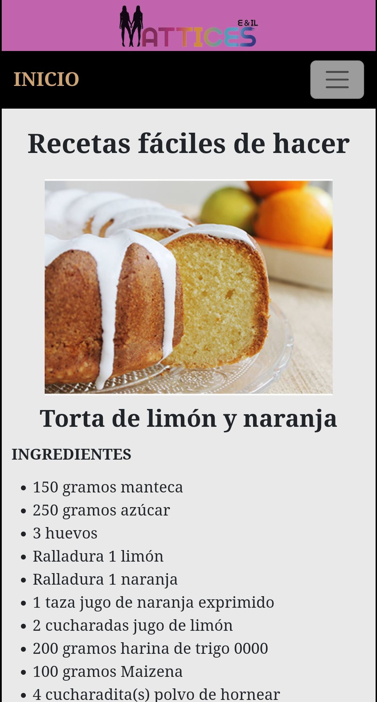
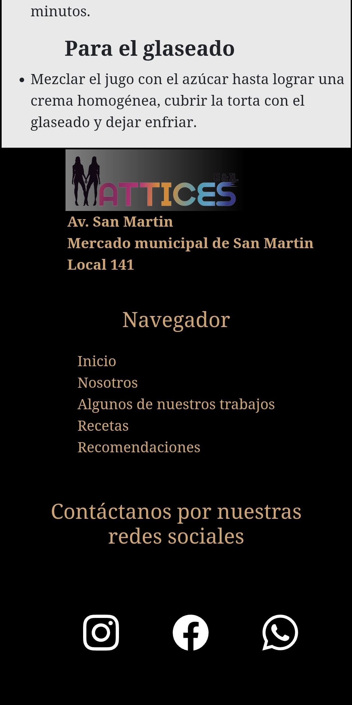

<h1>MATTICES</h1>
    
 Este es un repositorio del proyecto del curso Desarrollo Web

 
    <h2>Screenshot Desktop</h2>
        
         
        
         
    <h2>Screenshot Mobile</h2>
        
         
        
         
    <h2>Descripción de la web</h2>
        <ul>
            <li>Inicio</li>
            <li>Nosotros</li>
            <li>Trabajos realizados</li>
            <li>Recetas</li>
            <li>Recomendaciones</li>
                <ul>Todas las paginas cuentan con:
                    <li>Menu tanto para desktop como mobile</li>
                    <li>Footer con navegador</li>
                    <li>Direccion del local</li>
                    <li>Redes sociales</li>
                </ul>
        </ul>
<h2>Herramientas utilizadas para el desarrollo de la Página Web</h2>
 
    <ul>
        <li>HTML</li>
        <li>CSS</li>
        <li>GRID Y FLEX</li>
        <li>SASS</li>
    </ul>
     
<h2>Librerías utilizadas</h2>
    <ul>
        <li>BOOTSTRAP (https://getbootstrap.com/)</li>
        <li>ICONIFY (https://iconify.design/)</li>
        <li>GOOGLE FONTS (https://fonts.google.com/)</li>
        <li>ANIMATE.CSS (animate.style)</li>
    </ul>

